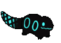
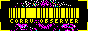
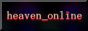

# greetings

hi i put other stuff here. you might just find something

are you in the know?

## // CURRENT OBJECTIVE //
- bridge
- html, css, js(?)

## // FINISHED STUFF //
- petgame

## // PROJECTS //
coming soon

## // WEBSITE //
exists, if you're in the know

---

rain world!!!

---
## fun facts
- i am decaying from lack of a good website hosting place
- there being no apostrophe in my username (outside of the profile and stuff) angers me to no end
- i am trying to make a long form project i can have fun with and be proud of
- i really have to learn new skills
- if you're peeping you likely aren't supposed to be here with a few exceptions so GET OUT!!!
---
       
